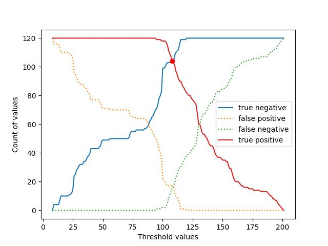

# Azhan-Mohammed

## How to use

To run inference on an image use the following steps:
```bash
git clone https://github.com/sheikhazhanmohammed/Azhan-Mohammed.git
cd Azhan-Mohammed/
python3 test_image.py path_to_image
```
This should return a console output saying day or night.
Sample command:
```bash
python3 test_image.py day-night-images/test/day/20151101_152050.jpg
```

## How the prediction works
The prediciton relies on the overall Vibrance value from the HSV channel of the image. I took overall sum of the Vibrance values, average it out over the area, and then used thresholds between the minimum and maximum value of obtained vibrance spectrum. The accepts and rejects can be found in the graph:



If the user wishes to use a different data source, they can first change the path of training images set in line 10 of ```optimal_threshold_selection.py ``` and get a new threshold value. This new value can then be replaced in line 25 of ```test_image.py``` and inference can be run again.